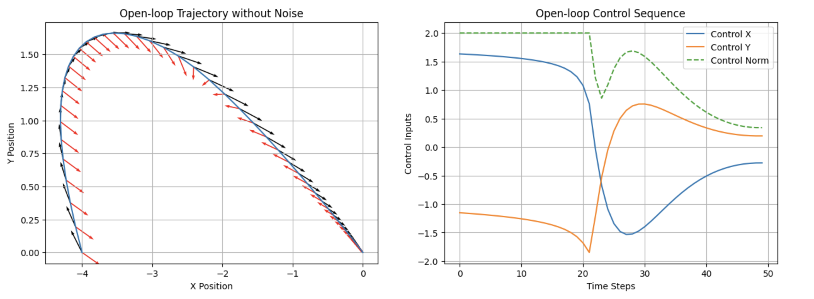
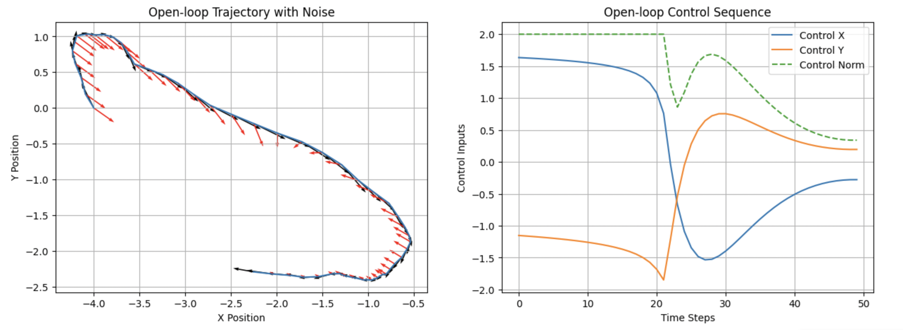
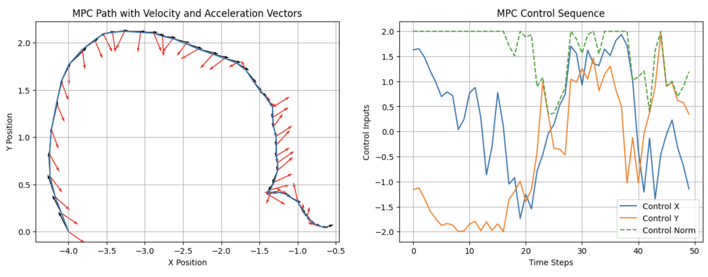

# Trajectory-optimization-using-LQR-and-MPC

In this project, our aim is to optimize the trajectory of a free-flying robot with respect to given dynamics and constraints. We will be using the Linear Quadratic Regulator (LQR) method for a non-noisy flying environment, and to achieve robustness against disturbance (wind in our case), we will use the Model Predictive Control (MPC) method.

## Documentation

You can find the detailed documentation in the PDF below:

Trajectory-optimization-using-LQR-and-MPC/
└── Trajectory optimization using LQR and MPC.pdf

[Trajectory optimization using LQR and MPC](Trajectory-optimization-using-LQR-and-MPC/Trajectory%20optimization%20using%20LQR%20and%20MPC)

You can find codes for the project below:

[Trajectory optimization using LQR and MPC](Trajectory-optimization-using-LQR-and-MPC/Trajectory%20optimization%20using%20LQR%20and%20MPC.pdf)
## Results

*Figure 1: Trajectory and Control Sequence obtained with LQR method without disturbance*

*Figure 2: Trajectory and Control Sequence obtained with LQR method with disturbance*

*Figure 3: rajectory and Control Sequence obtained with MPC method with disturbance*

## Conclusion
The LQR method works perfectly well in undisturbed environments, where there is no wind. It gives out a feasible solution that satisfiest the constraints while minimizingg the cost function. The code is not that complex; we simply plug in the quadratic convex objective term along with constraints into CVXPY to minimize it. However, in real-world conditions, there are disturbances like wind. When we add disturbances to our system, the LQR becomes non-robust against these unpredictable disturbances. Thus, we implemented MPC, which is a bit more complex algorithm. With the MPC algorithm, the robot performed well with its trajectory, getting close enough to the desired final state, and giving out a feasible solution. In this project, I explored the capabilities of both LQR and MPC.

